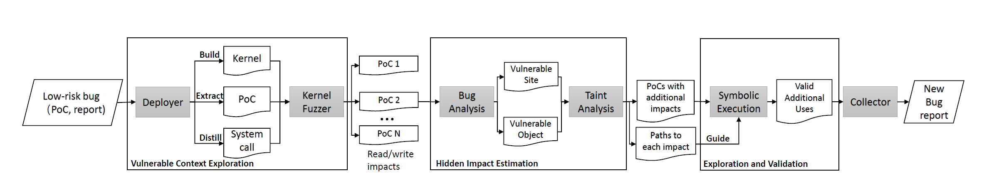

### How to inspect the results





After running SyzScope for the first time, it generated a main `work` folder under the current path. You can check the detailed structure of main `work` folder on [Workzone Structure](./workzone_structure.md).


The workflow of SyzScope shown above. Each component has their own output folder.

Fuzzing's output folder is `output` 

Static analysis's output folder is `static-xxx`

Symbolic execution output folder is `sym-xxx`


If a bug has been turned into high-risk by either fuzzing or symbolic execution, it will be moved to `succeed` folder under main `work` folder.


Normally, we only need to check the `output` and `sym-xxx` under `succeed` folder. By inspecting `repro.report`, we can find if a bug has been turn to high-risk through fuzzing. And `sym-xxx` shows the results from symbolic execution, the final report is printed on the bottom of `symbolic_execution.log` file.

```
2021-10-01 06:28:45,425 Thread 0: *******************primitives*******************

2021-10-01 06:28:45,425 Thread 0: Running for 0:01:50.495701
2021-10-01 06:28:45,425 Thread 0: Total 3 primitives found during symbolic execution

2021-10-01 06:28:45,425 Thread 0: The number of OOB/UAF write is 2

2021-10-01 06:28:45,425 Thread 0: The number of arbitrary address write is 0

2021-10-01 06:28:45,425 Thread 0: The number of constrained address write is 0

2021-10-01 06:28:45,425 Thread 0: The number of arbitrary value write is 0

2021-10-01 06:28:45,425 Thread 0: The number of constrained value write is 0

2021-10-01 06:28:45,425 Thread 0: The number of control flow hijacking is 1

2021-10-01 06:28:45,425 Thread 0: The number of invalid free is 0

2021-10-01 06:28:45,425 Thread 0: ************************************************
```

